# Лабораторная работа по предмету: "Технологии программирования"
## Тема: "Абстрактная фабрика"
> 4 курс 2 семестр \
> Студент группы 932223 - **Артеменко Антон Дмитриевич** 

## 1. Постановка задачи
Необходимо расширить реализацию генератора программ, чтобы обеспечить поддержку нескольких языков программирования в рамках одной архитектуры:
- C++
- C#
- Java

https://disk.yandex.ru/i/dtd6RCsC1FCtcg
Сгенерированные программы должны:
- корректно формироваться для выбранного языка;
- компилироваться без ошибок средствами соответствующего языка.

В рамках лабораторной работы требуется:
- добавить модификаторы классов и методов, отсутствующие в C++, но присутствующие в C# и Java;
- для C# ориентироваться на материалы: https://metanit.com/sharp/tutorial/3.2.php;
- для Java ориентироваться на материалы: http://proglang.su/java/modifiers (до п. 3.4 включительно);
- не включать модификаторы Java: synchronized, transient, volatile.

Для решения задачи использовать паттерн проектирования «Абстрактная фабрика».

## 2. Предлагаемое решение
### Зависимости проекта
В проекте используется:
- **CMake** v3.12
- **Стандарт C++** 17

### UML-диаграмма классов

```mermaid
%%{init: {'flowchart': {'nodeSpacing': 120, 'rankSpacing': 120}}}%%
classDiagram
    class CodeUnit {
        <<abstract>>
        +Flags
        +Append(unit, flagsValue)
        +Render(indentLevel) string
        #MakeIndent(indentLevel) string
    }

    class ICodeFactory {
        <<interface>>
        +CreateClass(name, flagsValue) CodeUnit
        +CreateMethod(name, returnType, flagsValue) CodeUnit
        +CreateField(name, type, flagsValue) CodeUnit
        +CreatePrintStatement(text) CodeUnit
        +GetLanguageName() string
    }

    class CppCodeFactory {
        +CreateClass(name, flagsValue) CodeUnit
        +CreateMethod(name, returnType, flagsValue) CodeUnit
        +CreateField(name, type, flagsValue) CodeUnit
        +CreatePrintStatement(text) CodeUnit
        +GetLanguageName() string
    }

    class CppClassUnit {
        +Append(unit, flagsValue)
        +Render(indentLevel) string
    }

    class CppMethodUnit {
        +RenderPrefixModifiers() string
        +RenderSuffixModifiers() string
        +IsAbstractMethod() bool
        +RenderAbstractTerminator() string
    }

    class CppPrintUnit {
        +RenderPrintExpression(text) string
    }

    class CppFieldUnit {
        +RenderPrefixModifiers() string
    }

    class JavaCodeFactory {
        +CreateClass(name, flagsValue) CodeUnit
        +CreateMethod(name, returnType, flagsValue) CodeUnit
        +CreateField(name, type, flagsValue) CodeUnit
        +CreatePrintStatement(text) CodeUnit
        +GetLanguageName() string
    }

    class JavaClassUnit {
        +Append(unit, flagsValue)
        +Render(indentLevel) string
    }

    class JavaMethodUnit {
        +RenderPrefixModifiers() string
        +IsAbstractMethod() bool
        +RenderAbstractTerminator() string
    }

    class JavaPrintUnit {
        +RenderPrintExpression(text) string
    }

    class JavaFieldUnit {
        +RenderPrefixModifiers() string
    }

    class CSharpCodeFactory {
        +CreateClass(name, flagsValue) CodeUnit
        +CreateMethod(name, returnType, flagsValue) CodeUnit
        +CreateField(name, type, flagsValue) CodeUnit
        +CreatePrintStatement(text) CodeUnit
        +GetLanguageName() string
    }

    class CSharpClassUnit {
        +Append(unit, flagsValue)
        +Render(indentLevel) string
    }

    class CSharpMethodUnit {
        +RenderPrefixModifiers() string
        +IsAbstractMethod() bool
        +RenderAbstractTerminator() string
    }

    class CSharpPrintUnit {
        +RenderPrintExpression(text) string
    }

    class CSharpFieldUnit {
        +RenderPrefixModifiers() string
    }

    class AbstractClassUnit {
        <<abstract>>
        +GetClassName() string
        +GetClassFlags() Flags
    }

    class AbstractMethodUnit {
        <<abstract>>
        +Append(unit, flagsValue)
        +Render(indentLevel) string
        +GetMethodFlags() Flags
    }

    class AbstractPrintUnit {
        <<abstract>>
        +Render(indentLevel) string
        +GetPrintText() string
    }

    class AbstractFieldUnit {
        <<abstract>>
        +Render(indentLevel) string
        +GetFieldFlags() Flags
    }

    class AccessControlledUnit {
        +Render(indentLevel) string
    }

    ICodeFactory <|.. CppCodeFactory
    ICodeFactory <|.. JavaCodeFactory
    ICodeFactory <|.. CSharpCodeFactory

    CodeUnit <|-- AbstractClassUnit
    CodeUnit <|-- AbstractMethodUnit
    CodeUnit <|-- AbstractPrintUnit
    CodeUnit <|-- AbstractFieldUnit

    AbstractClassUnit <|-- CppClassUnit
    AbstractMethodUnit <|-- CppMethodUnit
    AbstractPrintUnit <|-- CppPrintUnit
    AbstractFieldUnit <|-- CppFieldUnit

    AbstractClassUnit <|-- JavaClassUnit
    AbstractMethodUnit <|-- JavaMethodUnit
    AbstractPrintUnit <|-- JavaPrintUnit
    AbstractFieldUnit <|-- JavaFieldUnit

    AbstractClassUnit <|-- CSharpClassUnit
    AbstractMethodUnit <|-- CSharpMethodUnit
    AbstractPrintUnit <|-- CSharpPrintUnit
    AbstractFieldUnit <|-- CSharpFieldUnit

    CodeUnit <|-- AccessControlledUnit

    CSharpCodeFactory --> CSharpClassUnit
    CSharpCodeFactory --> CSharpMethodUnit
    CSharpCodeFactory --> CSharpFieldUnit
    CSharpCodeFactory --> CSharpPrintUnit

    CppCodeFactory --> CppClassUnit
    CppCodeFactory --> CppMethodUnit
    CppCodeFactory --> CppFieldUnit
    CppCodeFactory --> CppPrintUnit

    JavaCodeFactory --> JavaClassUnit
    JavaCodeFactory --> JavaMethodUnit
    JavaCodeFactory --> JavaFieldUnit
    JavaCodeFactory --> JavaPrintUnit
```


### Архитектура решения
Основные компоненты:
- **main.cpp** — точка входа демонстрации. Создает фабрики для C++, Java и C#, генерирует примеры классов и выводит результат в консоль.
- **code_factory** — контракт абстрактной фабрики:
    - **ICodeFactory** — общий интерфейс создания узлов (`CreateClass`, `CreateMethod`, `CreatePrintStatement`);
    - **CreateFactory(Language)** — выбор конкретной фабрики по целевому языку.
- **unit / CodeUnit** — базовая иерархия узлов генерации:
    - **CodeUnit** — абстрактный базовый узел с `Append` и `Render`;
    - конкретные узлы классов, методов и печати для каждого языка.
- **unit/src/cpp** — C++-реализация генерации:
    - **CppCodeFactory**;
    - **CppClassUnit**, **CppMethodUnit**, **CppPrintUnit**, **CppFieldUnit**.
- **unit/src/java** — Java-реализация генерации:
    - **JavaCodeFactory**;
    - **JavaClassUnit**, **JavaMethodUnit**, **JavaPrintUnit**.
- **unit/src/csharp** — C#-реализация генерации:
    - **CSharpCodeFactory**;
    - **CSharpClassUnit**, **CSharpMethodUnit**, **CSharpPrintUnit**.
- **unit/codegen_types.hpp** — общие перечисления модификаторов:
    - **AccessModifier** (включая C#-специфичные значения);
    - **MethodModifier** (`static`, `virtual`, `const`, `final`, `abstract`);
    - **ClassModifier** (`final`, `abstract`).

## 3. Инструкция для пользователя
Сборка проекта производится следующим образом:

<details>
<summary>Windows</summary>

Создайте директорию `build` и перейдите в нее:
```powershell
mkdir build
cd build
```

Сконфигурируйте и соберите проект:
```powershell
cmake .. && cmake --build .
```
Запустите программу:
```powershell
./program_generator
```

</details>

<details>
<summary>Linux / macOS</summary>

Создайте директорию `build` и перейдите в нее:
```bash
mkdir -p build && cd build
```

Сконфигурируйте и соберите проект:
```bash
cmake ..
cmake --build .
```

Запустите программу:
```bash
./program_generator
```

</details>

### Форматирование кода

Для автоматического форматирования всех исходных файлов используйте команду:

```bash
find . -name "*.cpp" -o -name "*.hpp" | grep -v "/build/" | xargs clang-format -i
```
