# Лабораторная работа по предмету: "Технологии программирования"
## Тема: "Абстрактная фабрика"
> 4 курс 2 семестр \
> Студент группы 932223 - **Артеменко Антон Дмитриевич** 

## 1. Постановка задачи
Необходимо расширить реализацию генератора программ, чтобы обеспечить поддержку нескольких языков программирования в рамках одной архитектуры:
- C++
- C#
- Java

https://disk.yandex.ru/i/dtd6RCsC1FCtcg
Сгенерированные программы должны:
- корректно формироваться для выбранного языка;
- компилироваться без ошибок средствами соответствующего языка.

В рамках лабораторной работы требуется:
- добавить модификаторы классов и методов, отсутствующие в C++, но присутствующие в C# и Java;
- для C# ориентироваться на материалы: https://metanit.com/sharp/tutorial/3.2.php;
- для Java ориентироваться на материалы: http://proglang.su/java/modifiers (до п. 3.4 включительно);
- не включать модификаторы Java: synchronized, transient, volatile.

Для решения задачи использовать паттерн проектирования «Абстрактная фабрика».

## 2. Предлагаемое решение
### Зависимости проекта
В проекте используется:
- **CMake** v3.12
- **Стандарт C++** 17

### UML-диаграмма классов

```mermaid
---
config:
  flowchart:
    nodeSpacing: 120
    rankSpacing: 120
  layout: elk
  look: classic
---
classDiagram

        class CodeUnit {
            <<abstract>>
            +Flags
            +Append(unit, flagsValue)
            +Append(unit, accessModifier)
            +Render(indentLevel) string
            #MakeIndent(indentLevel) string
        }

        class Language {
            <<enumeration>>
            Unknown
            CppLanguage
            JavaLanguage
            CSharpLanguage
        }

        class ICodeFactory {
            <<interface>>
            +CreateClass(name, flagsValue) CodeUnit
            +CreateClass(name, modifier) CodeUnit
            +CreateMethod(name, returnType, flagsValue) CodeUnit
            +CreateMethod(name, returnType, modifier) CodeUnit
            +CreateField(name, type, flagsValue) CodeUnit
            +CreateField(name, type, modifier) CodeUnit
            +CreatePrintStatement(text) CodeUnit
            +GetLanguageName() string
        }

        class CreateFactory {
            +CreateFactory(language) ICodeFactory
        }

        class AbstractClassUnit {
            <<abstract>>
            #GetClassName() string
            #GetClassFlags() Flags
        }

        class AbstractMethodUnit {
            <<abstract>>
            +Append(unit, flagsValue)
            +Render(indentLevel) string
            #RenderPrefixModifiers() string
            #RenderSuffixModifiers() string
            #IsAbstractMethod() bool
            #RenderAbstractTerminator() string
            #GetMethodFlags() Flags
        }

        class AbstractPrintUnit {
            <<abstract>>
            +Render(indentLevel) string
            #RenderPrintExpression(text) string
            #GetPrintText() string
        }

        class AbstractFieldUnit {
            <<abstract>>
            +Render(indentLevel) string
            #RenderPrefixModifiers() string
            #RenderSuffixModifiers() string
            #GetFieldFlags() Flags
        }

        class AccessControlledUnit {
            +Render(indentLevel) string
        }


    namespace codegen_cpp {
        class CppCodeFactory {
            +CreateClass(name, flagsValue) CodeUnit
            +CreateMethod(name, returnType, flagsValue) CodeUnit
            +CreateField(name, type, flagsValue) CodeUnit
            +CreatePrintStatement(text) CodeUnit
            +GetLanguageName() string
        }
        
        class CppClassUnit {
            +Append(unit, accessModifier)
            +Append(unit, flagsValue)
            +Render(indentLevel) string
        }

        class CppMethodUnit {
            #RenderPrefixModifiers() string
            #RenderSuffixModifiers() string
            #IsAbstractMethod() bool
            #RenderAbstractTerminator() string
        }

        class CppPrintUnit {
            #RenderPrintExpression(text) string
        }

        class CppFieldUnit {
            #RenderPrefixModifiers() string
        }
    }

    namespace codegen_java {
        class JavaCodeFactory {
            +CreateClass(name, flagsValue) CodeUnit
            +CreateMethod(name, returnType, flagsValue) CodeUnit
            +CreateField(name, type, flagsValue) CodeUnit
            +CreatePrintStatement(text) CodeUnit
            +GetLanguageName() string
        }

        class JavaClassUnit {
            +Append(unit, flagsValue)
            +Render(indentLevel) string
        }

        class JavaMethodUnit {
            #RenderPrefixModifiers() string
            #IsAbstractMethod() bool
            #RenderAbstractTerminator() string
        }

        class JavaPrintUnit {
            #RenderPrintExpression(text) string
        }

        class JavaFieldUnit {
            #RenderPrefixModifiers() string
        }
    }

    namespace codegen_csharp {
        class CSharpCodeFactory {
            +CreateClass(name, flagsValue) CodeUnit
            +CreateMethod(name, returnType, flagsValue) CodeUnit
            +CreateField(name, type, flagsValue) CodeUnit
            +CreatePrintStatement(text) CodeUnit
            +GetLanguageName() string
        }

        class CSharpClassUnit {
            +Append(unit, flagsValue)
            +Render(indentLevel) string
        }

        class CSharpMethodUnit {
            #RenderPrefixModifiers() string
            #IsAbstractMethod() bool
            #RenderAbstractTerminator() string
        }

        class CSharpPrintUnit {
            #RenderPrintExpression(text) string
        }

        class CSharpFieldUnit {
            #RenderPrefixModifiers() string
        }
    }

    ICodeFactory <|.. CppCodeFactory
    ICodeFactory <|.. JavaCodeFactory
    ICodeFactory <|.. CSharpCodeFactory

    CodeUnit <|-- AbstractClassUnit
    CodeUnit <|-- AbstractMethodUnit
    CodeUnit <|-- AbstractPrintUnit
    CodeUnit <|-- AbstractFieldUnit

    AbstractClassUnit <|-- CppClassUnit
    AbstractMethodUnit <|-- CppMethodUnit
    AbstractPrintUnit <|-- CppPrintUnit
    AbstractFieldUnit <|-- CppFieldUnit

    AbstractClassUnit <|-- JavaClassUnit
    AbstractMethodUnit <|-- JavaMethodUnit
    AbstractPrintUnit <|-- JavaPrintUnit
    AbstractFieldUnit <|-- JavaFieldUnit

    AbstractClassUnit <|-- CSharpClassUnit
    AbstractMethodUnit <|-- CSharpMethodUnit
    AbstractPrintUnit <|-- CSharpPrintUnit
    AbstractFieldUnit <|-- CSharpFieldUnit

    CodeUnit <|-- AccessControlledUnit

    CreateFactory --> Language
    CreateFactory --> ICodeFactory

    CSharpCodeFactory --> CSharpClassUnit
    CSharpCodeFactory --> CSharpMethodUnit
    CSharpCodeFactory --> CSharpFieldUnit
    CSharpCodeFactory --> CSharpPrintUnit

    CppCodeFactory --> CppClassUnit
    CppCodeFactory --> CppMethodUnit
    CppCodeFactory --> CppFieldUnit
    CppCodeFactory --> CppPrintUnit

    JavaCodeFactory --> JavaClassUnit
    JavaCodeFactory --> JavaMethodUnit
    JavaCodeFactory --> JavaFieldUnit
    JavaCodeFactory --> JavaPrintUnit

    JavaClassUnit --> AccessControlledUnit
    CSharpClassUnit --> AccessControlledUnit
```


### Архитектура решения
Основные компоненты:
- **main.cpp** — точка входа демонстрации. Создает фабрики для C++, Java и C#, генерирует примеры классов и выводит результат в консоль.
- **code_factory** — контракт абстрактной фабрики:
    - **ICodeFactory** — общий интерфейс создания узлов (`CreateClass`, `CreateMethod`, `CreatePrintStatement`);
    - **CreateFactory(Language)** — выбор конкретной фабрики по целевому языку.
- **unit / CodeUnit** — базовая иерархия узлов генерации:
    - **CodeUnit** — абстрактный базовый узел с `Append` и `Render`;
    - конкретные узлы классов, методов и печати для каждого языка.
- **unit/src/cpp** — C++-реализация генерации:
    - **CppCodeFactory**;
    - **CppClassUnit**, **CppMethodUnit**, **CppPrintUnit**, **CppFieldUnit**.
- **unit/src/java** — Java-реализация генерации:
    - **JavaCodeFactory**;
    - **JavaClassUnit**, **JavaMethodUnit**, **JavaPrintUnit**.
- **unit/src/csharp** — C#-реализация генерации:
    - **CSharpCodeFactory**;
    - **CSharpClassUnit**, **CSharpMethodUnit**, **CSharpPrintUnit**.
- **unit/codegen_types.hpp** — общие перечисления модификаторов:
    - **AccessModifier** (включая C#-специфичные значения);
    - **MethodModifier** (`static`, `virtual`, `const`, `final`, `abstract`);
    - **ClassModifier** (`final`, `abstract`).

## 3. Инструкция для пользователя
Сборка проекта производится следующим образом:

<details>
<summary>Windows</summary>

Создайте директорию `build` и перейдите в нее:
```powershell
mkdir build
cd build
```

Сконфигурируйте и соберите проект:
```powershell
cmake .. && cmake --build .
```
Запустите программу:
```powershell
./program_generator
```

</details>

<details>
<summary>Linux / macOS</summary>

Создайте директорию `build` и перейдите в нее:
```bash
mkdir -p build && cd build
```

Сконфигурируйте и соберите проект:
```bash
cmake ..
cmake --build .
```

Запустите программу:
```bash
./program_generator
```

</details>

### Тестирование с помощью `Demo(...)`

Для ручной проверки генерации примеров используется функция `examples::Demo(...)` из [examples.hpp](./examples.hpp).
Она принимает:

- `language` — целевой язык генерации (`CppLanguage`, `JavaLanguage`, `CSharpLanguage`);
- `classFlags` — флаги модификаторов класса;
- `methods` — список методов `std::vector<examples::MethodConfig>`;
- `fields` — список полей `std::vector<examples::FieldConfig>`;
- `className` — необязательное имя класса, по умолчанию `"DemoClass"`.

Сигнатура:

```cpp
std::string Demo(codegen::Language language,
                 codegen::CodeUnit::Flags classFlags,
                 const std::vector<MethodConfig>& methods,
                 const std::vector<FieldConfig>& fields,
                 const std::string& className = "DemoClass");
```

Структуры параметров:

```cpp
struct MethodConfig
{
    std::string name;
    std::string returnType;
    codegen::CodeUnit::Flags flags;
    codegen::AccessModifier access;
    std::vector<std::string> printStatements;
};

struct FieldConfig
{
    std::string name;
    std::string type;
    codegen::CodeUnit::Flags flags;
    codegen::AccessModifier access;
};
```

Пример заполнения:

```cpp
std::cout << examples::Demo(
    codegen::Language::CppLanguage,
    0,
    {
        {"Run", "void", 0, codegen::AccessModifier::PublicAccess, {"Hello from method"}},
        {"Log", "void", examples::ToFlags(codegen::MethodModifier::StaticModifier),
         codegen::AccessModifier::ProtectedAccess, {"Static call"}},
    },
    {
        {"name_", "std::string", examples::ToFlags(codegen::MethodModifier::ConstModifier),
         codegen::AccessModifier::PrivateAccess},
        {"count_", "int", 0, codegen::AccessModifier::PrivateAccess},
    },
    "ManualDemo");
```

Что делает `Demo(...)`:

1. Создает фабрику через `CreateFactory(language)`.
2. Создает класс с именем `className` и флагами `classFlags`.
3. Добавляет все поля из `fields`.
4. Добавляет все методы из `methods`.
5. Для каждого текста из `printStatements` создает print-оператор и вставляет его в тело метода.
6. Возвращает итоговый результат `Render()`.

### Unit-тесты (GoogleTest)

Сборка и запуск unit-тестов:

```bash
cmake -S . -B build -DPROGRAM_GENERATOR_BUILD_TESTS=ON
cmake --build build --target build_tests --parallel
ctest --test-dir build --output-on-failure
```

### Генерация отчета о покрытии

Ниже последовательность полного цикла: чистая coverage-сборка, сборка приложения и тестов,
прогон тестов и генерация HTML-отчета покрытия только по исходникам `.cpp` проекта.

```bash
rm -rf build-coverage
cmake -S . -B build-coverage -DPROGRAM_GENERATOR_BUILD_TESTS=ON -DCMAKE_BUILD_TYPE=Debug -DCMAKE_CXX_FLAGS="--coverage -O0 -g"
cmake --build build-coverage --target program_generator build_tests --parallel
find build-coverage -name '*.gcda' -delete
ctest --test-dir build-coverage --output-on-failure

if command -v llvm-cov >/dev/null 2>&1; then
    GCOV_EXEC="$(command -v llvm-cov) gcov"
elif command -v xcrun >/dev/null 2>&1 && xcrun --find llvm-cov >/dev/null 2>&1; then
    GCOV_EXEC="$(xcrun --find llvm-cov) gcov"
else
    GCOV_EXEC="gcov"
fi

cd build-coverage
rm -f coverage_cpp*
find . -name '*.gcov' -delete
gcovr -r .. \
    --gcov-executable "$GCOV_EXEC" \
    --filter ".*/unit/src/.*\.cpp$" \
    --exclude ".*/main\.cpp$" \
    --exclude ".*/tests/.*" \
    --exclude ".*/CMakeFiles/.*" \
    --exclude ".*/build-coverage/.*" \
    --exclude ".*CMakeCXXCompilerId\.cpp$" \
    --exclude ".*\.hpp$" \
    --exclude-unreachable-branches \
    --exclude-throw-branches \
    --decisions \
    --html-details coverage_cpp.html

gcovr -r .. \
    --gcov-executable "$GCOV_EXEC" \
    --filter ".*/unit/src/.*\.cpp$" \
    --exclude ".*/main\.cpp$" \
    --exclude ".*/tests/.*" \
    --exclude ".*/CMakeFiles/.*" \
    --exclude ".*/build-coverage/.*" \
    --exclude ".*CMakeCXXCompilerId\.cpp$" \
    --exclude ".*\.hpp$" \
    --exclude-unreachable-branches \
    --exclude-throw-branches \
    --decisions \
    --txt \
    --txt-metric decision \
    --print-summary
```
Открыть отчет:

```bash
open build-coverage/coverage_cpp.html
```

### Форматирование кода

Для автоматического форматирования всех исходных файлов используйте команду:

```bash
find . -name "*.cpp" -o -name "*.hpp" | grep -v "/build/" | xargs clang-format -i
```
