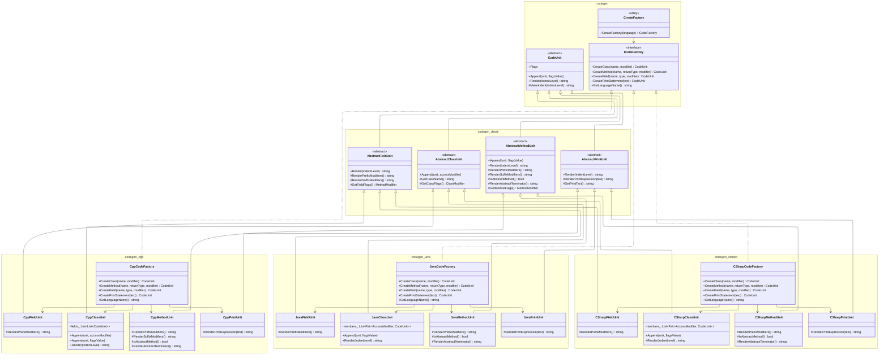

```mermaid
---
config:
  flowchart:
    nodeSpacing: 120
    rankSpacing: 120
  layout: elk
  look: classic
---
classDiagram
    namespace codegen {
        class CodeUnit {
            <<abstract>>
            +Flags
            +Append(unit, flagsValue)
            +Render(indentLevel) string
            #MakeIndent(indentLevel) string
        }

        class ICodeFactory {
            <<interface>>
            +CreateClass(name, modifier) CodeUnit
            +CreateMethod(name, returnType, modifier) CodeUnit
            +CreateField(name, type, modifier) CodeUnit
            +CreatePrintStatement(text) CodeUnit
            +GetLanguageName() string
        }

        class CreateFactory {
            <<utility>>
            +CreateFactory(language) ICodeFactory
        }
    }

    namespace codegen_detail {
        class AbstractClassUnit {
            <<abstract>>
            +Append(unit, accessModifier)
            #GetClassName() string
            #GetClassFlags() ClassModifier
        }

        class AbstractMethodUnit {
            <<abstract>>
            +Append(unit, flagsValue)
            +Render(indentLevel) string
            #RenderPrefixModifiers() string
            #RenderSuffixModifiers() string
            #IsAbstractMethod() bool
            #RenderAbstractTerminator() string
            #GetMethodFlags() MethodModifier
        }

        class AbstractPrintUnit {
            <<abstract>>
            +Render(indentLevel) string
            #RenderPrintExpression(text) string
            #GetPrintText() string
        }

        class AbstractFieldUnit {
            <<abstract>>
            +Render(indentLevel) string
            #RenderPrefixModifiers() string
            #RenderSuffixModifiers() string
            #GetFieldFlags() MethodModifier
        }
    }

    namespace codegen_cpp {
        class CppCodeFactory {
            +CreateClass(name, modifier) CodeUnit
            +CreateMethod(name, returnType, modifier) CodeUnit
            +CreateField(name, type, modifier) CodeUnit
            +CreatePrintStatement(text) CodeUnit
            +GetLanguageName() string
        }

        class CppClassUnit {
            +Append(unit, accessModifier)
            +Append(unit, flagsValue)
            +Render(indentLevel) string
            -fields_ List~List~CodeUnit~~
        }

        class CppMethodUnit {
            #RenderPrefixModifiers() string
            #RenderSuffixModifiers() string
            #IsAbstractMethod() bool
            #RenderAbstractTerminator() string
        }

        class CppFieldUnit {
            #RenderPrefixModifiers() string
        }

        class CppPrintUnit {
            #RenderPrintExpression(text) string
        }
    }

    namespace codegen_java {
        class JavaCodeFactory {
            +CreateClass(name, modifier) CodeUnit
            +CreateMethod(name, returnType, modifier) CodeUnit
            +CreateField(name, type, modifier) CodeUnit
            +CreatePrintStatement(text) CodeUnit
            +GetLanguageName() string
        }

        class JavaClassUnit {
            +Append(unit, flagsValue)
            +Render(indentLevel) string
            -members_ List~Pair~AccessModifier, CodeUnit~~
        }

        class JavaMethodUnit {
            #RenderPrefixModifiers() string
            #IsAbstractMethod() bool
            #RenderAbstractTerminator() string
        }

        class JavaPrintUnit {
            #RenderPrintExpression(text) string
        }

        class JavaFieldUnit {
            #RenderPrefixModifiers() string
        }
    }

    namespace codegen_csharp {
        class CSharpCodeFactory {
            +CreateClass(name, modifier) CodeUnit
            +CreateMethod(name, returnType, modifier) CodeUnit
            +CreateField(name, type, modifier) CodeUnit
            +CreatePrintStatement(text) CodeUnit
            +GetLanguageName() string
        }

        class CSharpClassUnit {
            +Append(unit, flagsValue)
            +Render(indentLevel) string
            -members_ List~Pair~AccessModifier, CodeUnit~~
        }

        class CSharpMethodUnit {
            #RenderPrefixModifiers() string
            #IsAbstractMethod() bool
            #RenderAbstractTerminator() string
        }

        class CSharpPrintUnit {
            #RenderPrintExpression(text) string
        }

        class CSharpFieldUnit {
            #RenderPrefixModifiers() string
        }
    }

    ICodeFactory <|.. CppCodeFactory
    ICodeFactory <|.. JavaCodeFactory
    ICodeFactory <|.. CSharpCodeFactory

    CodeUnit <|-- AbstractClassUnit
    CodeUnit <|-- AbstractMethodUnit
    CodeUnit <|-- AbstractPrintUnit
    CodeUnit <|-- AbstractFieldUnit

    AbstractClassUnit <|-- CppClassUnit
    AbstractMethodUnit <|-- CppMethodUnit
    AbstractPrintUnit <|-- CppPrintUnit
    AbstractFieldUnit <|-- CppFieldUnit

    AbstractClassUnit <|-- JavaClassUnit
    AbstractMethodUnit <|-- JavaMethodUnit
    AbstractPrintUnit <|-- JavaPrintUnit
    AbstractFieldUnit <|-- JavaFieldUnit

    AbstractClassUnit <|-- CSharpClassUnit
    AbstractMethodUnit <|-- CSharpMethodUnit
    AbstractPrintUnit <|-- CSharpPrintUnit
    AbstractFieldUnit <|-- CSharpFieldUnit

    CreateFactory --> ICodeFactory

    CSharpCodeFactory --> CSharpClassUnit
    CSharpCodeFactory --> CSharpMethodUnit
    CSharpCodeFactory --> CSharpFieldUnit
    CSharpCodeFactory --> CSharpPrintUnit

    CppCodeFactory --> CppClassUnit
    CppCodeFactory --> CppMethodUnit
    CppCodeFactory --> CppFieldUnit
    CppCodeFactory --> CppPrintUnit

    JavaCodeFactory --> JavaClassUnit
    JavaCodeFactory --> JavaMethodUnit
    JavaCodeFactory --> JavaFieldUnit
    JavaCodeFactory --> JavaPrintUnit
```